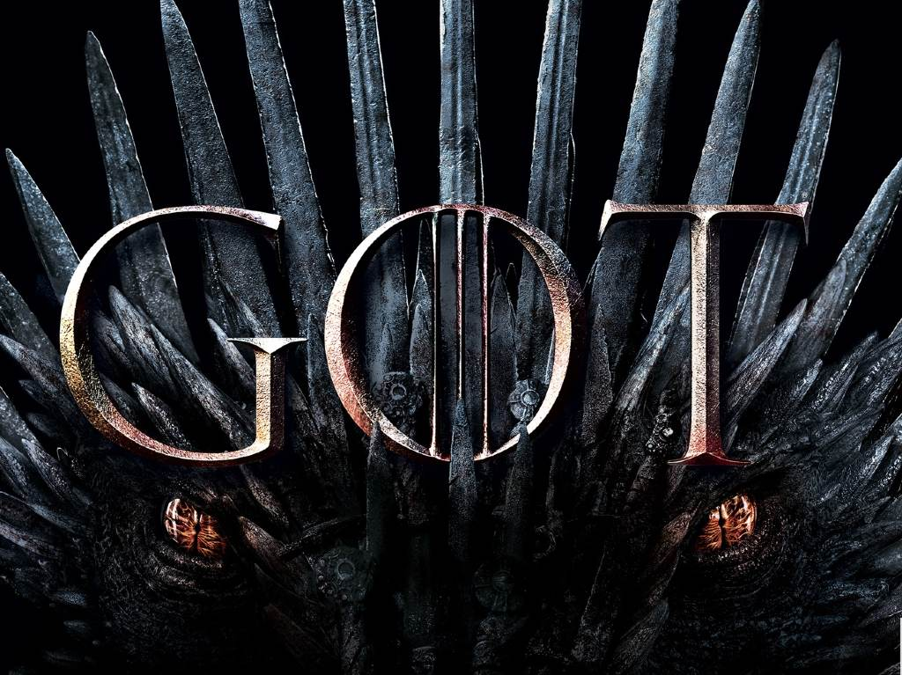

 ## ★ Proyecto: Game Of Thrones
 ####  Este proyecto forma parte del curso Desarrollo Web, dictado por Coderhouse.

 #####   - Profesor: Rodrigo Zungri
 #####   - Coordinadora: Vanina Federici 
 #####   - Tutora: Micaela Isla

 Website:  
[Mira aquí mi Editor](https://gameof-thrones.netlify.app/) 

 ⋆ Diseño responsivo:
   - Smartphone
   - Tablet

 ⋆ Construido con:
   - ✔ HTML
   - ✔ CSS
   - ✔ SASS
   - ✔ Deploy en NETLIFY

 ⋆ Recursos:
   - ✔  Fuente: https://fonts.google.com/
   - 🎨 Paleta de Colores: https://coolors.co/ 
   - 📷 Imagenes: La imagenes utilizadas en esta página se descargaron principalmente de: www.google.com

  